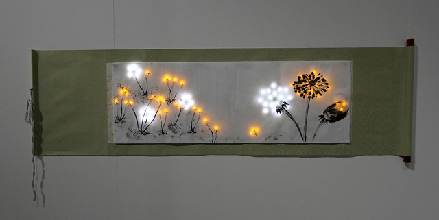

The three images below represent a sampling of LED based art-work found in Jie Qi's Flickr feed. I find these pieces to utilize the medium of the LED in unique and interesting ways. The medium of LED light in all three cases acts as a compliment for another medium. In the first image the LED brings to life to dead (or fake) butterfly wings by backlighting the wings. The butterfly wings really jump out of the pages of a book, which making the piece seem eerily alive. I could see this method being used to backlight elements of a picture book by projecting light to give depth to the image. By providing a backlight, the elements can appear to be more animate and colorful. Backlights could even be used to contract different elements of the same page. You could even project animation onto physical elements, thereby telling the story utilizes both the physical and projected mediums. The author could project light, but block a specific area to give the appears of a characters silhouette. *The Book* offers an example which takes the concept to an extreme, where light is by far the dominate part of the medium. ***Another model of projection-animated pop-up structures might be found in The Icebook (2011) by Davy and Kristin McGuire. Described by its creators as “a miniature theatre show made of paper and light,” the book uses projection mapping to play a fairy tale across a series of eleven blank pop-up pages.*** (*The Book* p. 2179) Although this is an interesting way to tell a story, I find that a more hybrid medium can tell a distinctly different story from what could simply be captured through animation. 

The second  images I've provide, may not be as elegant a piece as the first, however, it offers a stepping stone to a unique way in which this medium can be animated. The medium of the battery-powered electric light could utilize timers which trigger switches to turn on, off, dim, or brighten each LED according to a programmable sequence. The artist would be able create animations using the imbedded LED lights, the could for instance create a wave pattern which moves back and forth across the object turning on lights. Essentially you could turn ordinary plush objects like this strawberry into a kind of of disco light. That might get annoying but its definitely an interesting use of the medium.

This third piece brings to mind another way this medium could be animate. Instead of displaying motion, I could see a piece like this displaying the passage of time by showing the plants through the seasons. Each season would have its own set of lights and they would all be connected to a single controller which cycles through the lights according to each season in sequence. For winter, there would be no light at all, just the stems, then the spring with its vibrant green light, then the summer with its variety of rich colors, and finally fall with its oranges and browns. I really like this idea of a piece which evolves over time. It's an interesting way to animate an otherwise still piece. 

Images curtesy of [Jie Qi’s Flickr feed](https://www.flickr.com/photos/jieq/)

Borsuk, Amaranth. The Book (MIT Press Essential Knowledge series) . The MIT Press. Kindle Edition. 